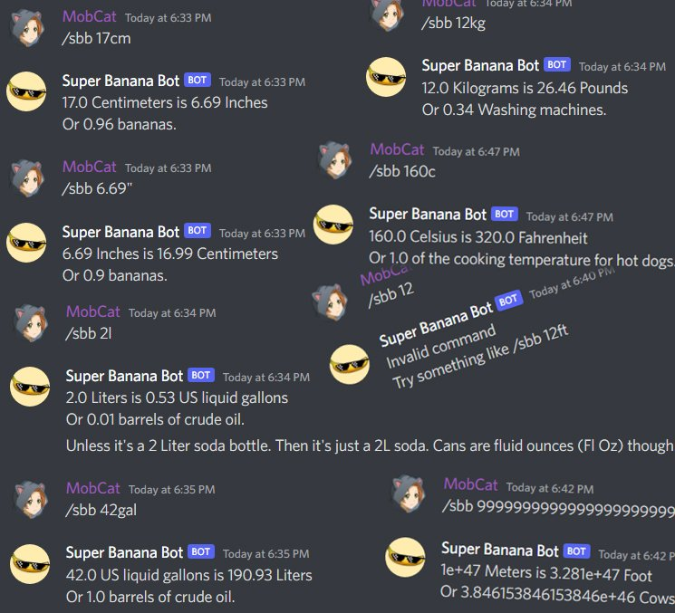

# Super Banana Bot
Banana for scale discord bot

----------
**What is this?** 
This is a small discord bot program that will help you convert whatever your American friends are talking about. 
The goal was to make a simple command to look up an imperial measurement without needing to look it up on Google. 
As this bot was written mostly as a meme that became useful it can only do basic convert A to B kinda stuff and can't do anything more complex then that. 
It's also programmed as a meme, so it doesn't really follow any "best practices" but it works and that's all that really matters.  
**Conversion table** 
Demonstrating you can convert m to ft and vice versa but you can not convert m to km for eg. 

| Command   | Measurement                   |
| --------- | ----------------------------- |
|cm / "     | Centimeters / Inches          |
|m / ft     | Meters / Foot                 |
|km / mi    | Kilometers / Miles            |
|g / oz     | Grams / Ounces                |
|kg / lb    | Kilograms / Pounds            |
|ml / fl oz | Milliliters / US Fluid Ounces |
|l / gal    | Liters / US liquid gallons    |
|c / f      | Celsius / Fahrenheit          |

Missing Millimeters as I don't know what to convert that to in imperial. 
Missing yard as 1 yard is only 3 foot so it seems redundant.  
**How to install** 
1. Goto [https://discord.com/developers/applications](https://discord.com/developers/applications "https://discord.com/developers/applications") and make a new bot called Super Banana Bot. In this repository there is an icon.png as well you can use for the bot. 
2. Next download the `Banana.py` from this repository to somewhere you want to run it from. 
3. Now you want to copy your auth token for the bot from the discord apps page and place it in the 
`BotToken = YourTokenHere` 
section at the top of `Banana.py`. Again this is not "best practices" but its easy and quick. 
and remember to save the py and exit. 
4. (kinda optional) If you have never used a python discord bot before, you will need to install the discord.py api. You can do this by running the command 
`pip install discord`
5. Now we can run the bot with `python Banana.py` from the command line. 
6. Next we need to invite the bot to our server. We can do this by making an invite link for the bot from the discord apps page or, on the discord apps page, in the url bar you will see something like 
https://discord.com/developers/applications/Your_ID_Is_Here/information 
copy that ID number from there to 
https://discord.com/api/oauth2/authorize?client_id=Your_ID_Goes_Here&permissions=2147798080&scope=bot 
Again not "best practices" but it's quick and it's easy. 
7. Now with the python scrip running and the bot invited to your server, we should see the bot is now online. 
we can talk to the bot by sending a command in any channel like 
`\sbb 12cm` 
and Super Banana Bot will take that 12 Centimeters, convert it into 4.72 Inches and send that info back to you in chat. 
You can see a full list of commands in the Conversion table above or some examples in the picture even more above.  

**Improvements?** 
Well it goes without saying I should clean up the shit ton of if statements but for now it "just works" providing you order them correctly eg. km before k and or m. 
It would be cool to have a semi random look up table for the joke measurements aka america will use anything but the metric system. 
I had a lot of good suggestions like the temperature of a lukewarm dog or the top speed of a mustang. So it be nice to role them in randomly so its not always the same joke over and over again. 
Might add yard as a parentheses eg. 
6.0 Meters is 19.69 Foot (6.56 Yard)  

**"bugs"** 
No major game braking stuff just, 
Some of the joke measurements might be off but I think I got most of them, but if I didn't let me know. 
For some dumb reson I dont understand because im dumb, discord wont let you include capitals in a /command. 
The screen will just shake at you, forcing you to change your `/sbb 12Fl` to `/sbb 12fl` 
Any math overflow or underflow is handled by the stock python math lib but, it does return some weird results so, maybe make a check so people can't put stupid numbers in the chat, but also its kinda part of the meme.
